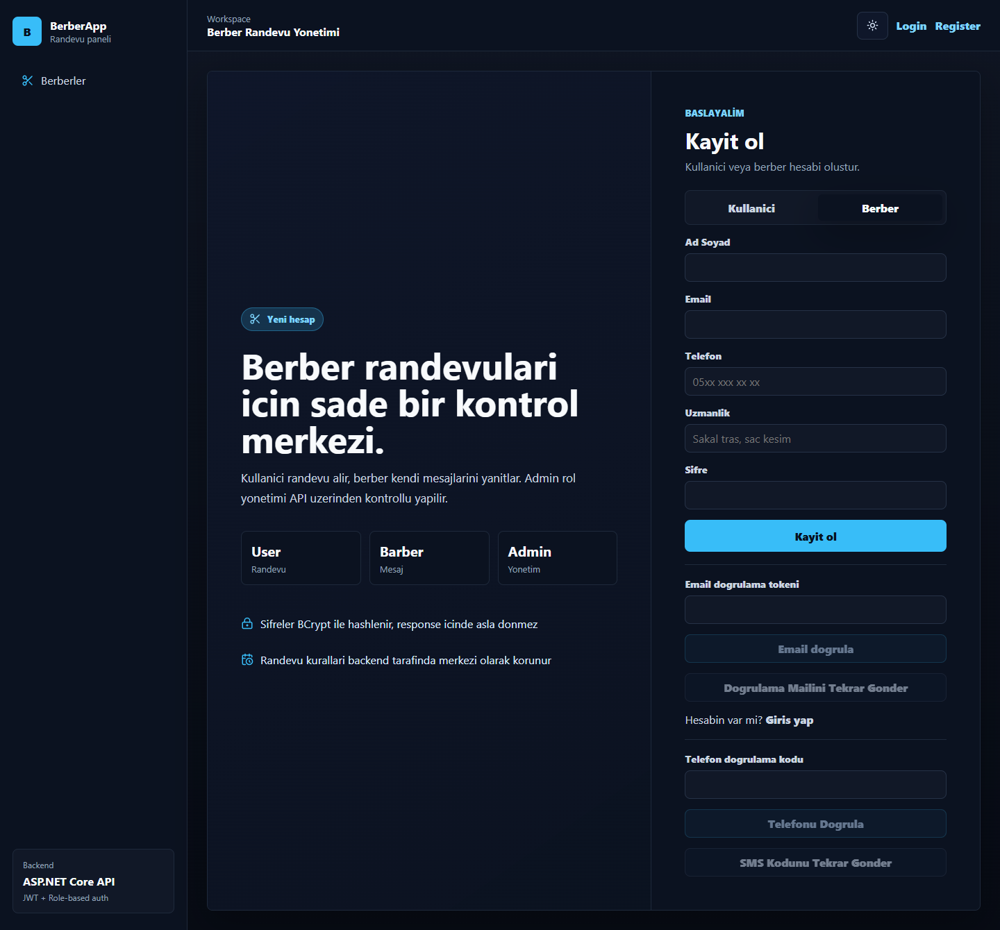
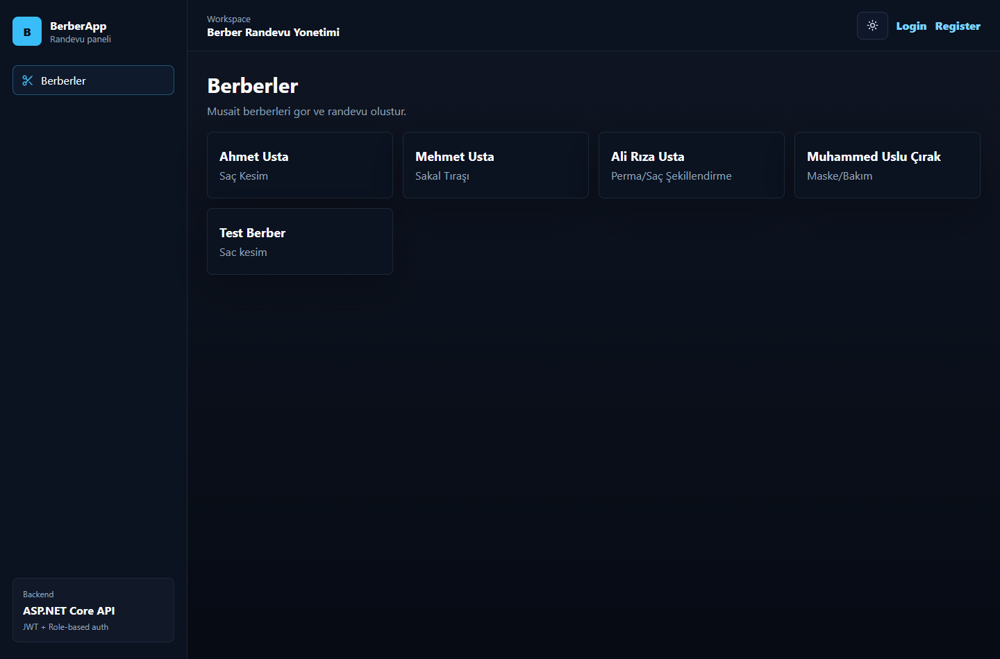
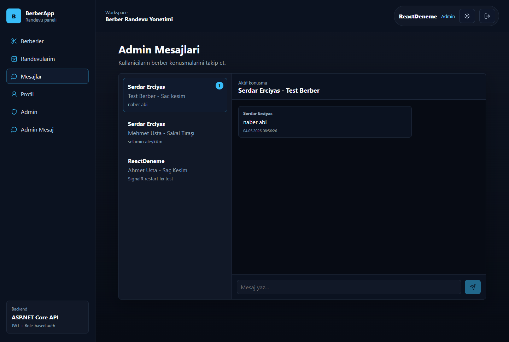
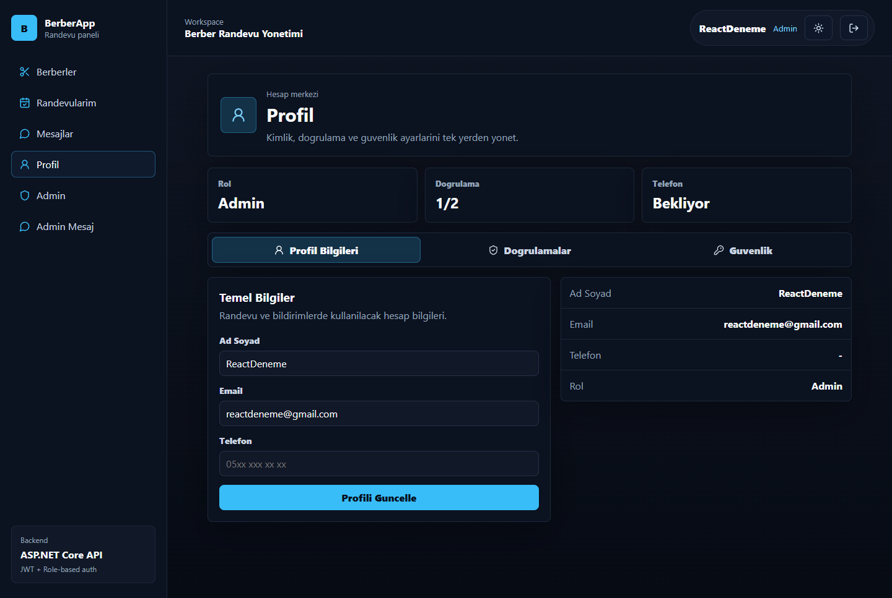
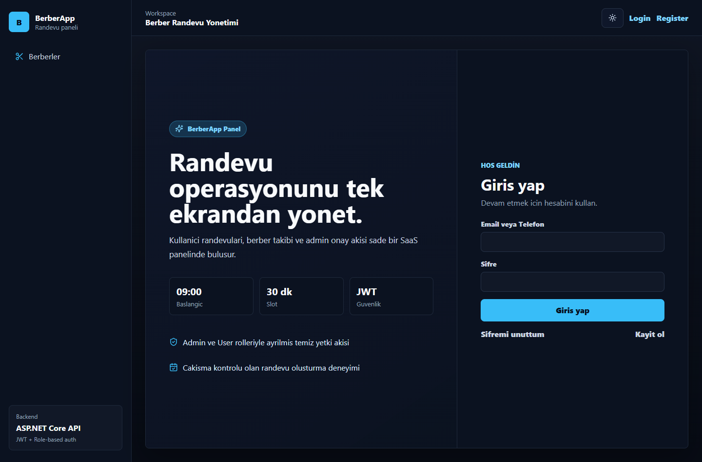
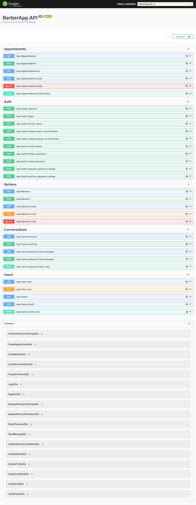

# BerberApp API

BerberApp API, berber randevularini yonetmek icin gelistirilmis katmanli mimariye sahip bir ASP.NET Core Web API ve React panel projesidir. Proje junior backend developer seviyesinde, okunabilir ve gelistirilebilir bir referans proje olarak hazirlanmistir.

## Proje Ozeti

Bu proje ile kullanicilar kayit olabilir, giris yapabilir, berberleri ve dukkanlari listeleyebilir, harita uzerinden yakin dukkanlari gorebilir, randevu olusturabilir ve berberlerle gercek zamanli mesajlasabilir. Berber hesaplari kendilerine gelen mesajlari ve kendi randevu akisini takip edebilir. Admin rolundeki kullanicilar berber CRUD islemlerini, kullanici rol yonetimini, mesajlari ve randevu durum guncellemelerini yonetebilir.

## One Cikan Noktalar

- Katmanli mimari: `API -> Business -> DataAccess -> Entities`
- JWT authentication ve role-based authorization
- Email/telefon dogrulama akislari
- SignalR ile gercek zamanli mesajlasma
- Harita tabanli dukkan kesfi ve yakin dukkan endpointi
- 30 dakikalik slot mantigi ile modern randevu olusturma ekrani
- Aktif randevusu olan kullanicinin yeni randevu alamamasi gibi business rule'lar
- Berberler icin bugunku randevulari saat saat gorebilecekleri takvim akisi
- Kullanici ve berber profilleri icin URL bazli fotograf destegi

## Ekran Goruntuleri

| Berber kaydi | Berber listesi |
| --- | --- |
|  |  |

| Mesajlasma | Profil merkezi |
| --- | --- |
|  |  |

| Login | Swagger |
| --- | --- |
|  |  |

## Kullanilan Teknolojiler

- C#
- ASP.NET Core Web API (.NET 8)
- Entity Framework Core
- SQL Server
- JWT Authentication
- Role-based Authorization
- SignalR
- Swagger / OpenAPI
- BCrypt.Net-Next
- React + Vite + TypeScript

## Katmanli Mimari

Proje 4 ana katmandan olusur:

- `BerberApp.API`: Controller, middleware, Swagger ve uygulama konfigurasyonu
- `BerberApp.Business`: DTO, service ve business kurallari
- `BerberApp.DataAccess`: EF Core `AppDbContext` ve migrationlar
- `BerberApp.Entities`: Entity modelleri

Akis:

```text
API -> Business -> DataAccess -> Entities
```

## Temel Ozellikler

- Kullanici kayit ve giris islemleri
- Email dogrulama akisi
- Telefon numarasi ile kayit/giris ve development SMS dogrulama akisi
- Mail onayli sifre sifirlama ve sifre degistirme
- BCrypt ile sifre hashleme
- JWT token uretimi
- Admin/User/Barber rol ayrimi
- Swagger uzerinden JWT authorize destegi
- Berber CRUD
- Berber hesabi ile kayit olma
- Dukkan/Shop CRUD ve dukkana bagli berberler
- Konuma gore yakindaki dukkanlari listeleme
- SignalR ile kullanici-berber mesajlasma
- Randevu CRUD
- Musait slot endpointi (`GET /api/appointments/available-slots`)
- Randevu saat cakismasi kontrolu
- Randevu kurallari:
  - Gecmis tarihe randevu alinamaz
  - Bugun icin gecmis saate randevu alinamaz
  - Randevu saatleri 09:00-18:00 arasindadir
  - Son slot 17:30'dur
  - Sadece `00` ve `30` dakikalari kabul edilir
  - Aktif (`Pending` veya `Approved`) randevusu olan kullanici yeni randevu alamaz
  - Kullanici sadece kendi `Pending` randevusunu silebilir
- Randevu olusturuldugunda kullaniciya ve berbere HTML ozet maili gonderimi
- Standart API response modeli
- Global exception middleware
- DTO validation

## Ogrenilen Konular

Bu proje sadece CRUD endpointlerinden ibaret degildir. Gelistirme surecinde su alanlarda pratik yapilmis oldu:

- Authentication/authorization tasarimi
- Katmanli mimaride service sorumluluklari
- Validation ve business rule ayrimi
- SignalR ile gerçek zamanli iletisim
- Harita ve konum tabanli listeleme
- Mail ve dogrulama akislari
- Backend kurallarini destekleyen frontend UX tasarimi

## Kurulum

1. Repoyu klonlayin.

```bash
git clone <repo-url>
cd BerberApp.API
```

2. `BerberApp.API/appsettings.Example.json` dosyasini referans alarak `BerberApp.API/appsettings.Development.json` dosyasini olusturun.

Local development icin gercek secret'lari dosyaya yazmak yerine `dotnet user-secrets` kullanmaniz onerilir.

Ornek:

```json
{
  "ConnectionStrings": {
    "SqlConnection": "Server=localhost;Database=BerberAppDb;User Id=sa;Password=YOUR_PASSWORD;Encrypt=False;TrustServerCertificate=True;"
  },
  "Jwt": {
    "Key": "CHANGE_ME_TO_A_LONG_SECRET_KEY_AT_LEAST_32_CHARS",
    "Issuer": "berberapi",
    "Audience": "berberapi"
  },
  "Email": {
    "UseSmtp": false,
    "ShowDevelopmentTokens": true,
    "Smtp": {
      "Host": "smtp.gmail.com",
      "Port": 587,
      "EnableSsl": true,
      "UserName": "YOUR_EMAIL@gmail.com",
      "Password": "YOUR_APP_PASSWORD",
      "FromEmail": "YOUR_EMAIL@gmail.com",
      "FromName": "BerberApp"
    }
  },
  "Sms": {
    "ShowDevelopmentCodes": true
  }
}
```

Ornek `user-secrets` komutlari:

```bash
dotnet user-secrets --project BerberApp.API set "ConnectionStrings:SqlConnection" "Server=localhost;Database=BerberAppDb;User Id=sa;Password=YOUR_PASSWORD;Encrypt=False;TrustServerCertificate=True;"
dotnet user-secrets --project BerberApp.API set "Jwt:Key" "CHANGE_ME_TO_A_LONG_SECRET_KEY_AT_LEAST_32_CHARS"
dotnet user-secrets --project BerberApp.API set "Email:Smtp:UserName" "YOUR_EMAIL@gmail.com"
dotnet user-secrets --project BerberApp.API set "Email:Smtp:Password" "YOUR_APP_PASSWORD"
dotnet user-secrets --project BerberApp.API set "Email:Smtp:FromEmail" "YOUR_EMAIL@gmail.com"
```

Bu yontemde `appsettings.Development.json` icinde placeholder degerler kalir, gercek secret'lar ise sadece makinenizde saklanir.

3. Migrationlari veritabanina uygulayin.

```bash
dotnet ef database update --project BerberApp.DataAccess --startup-project BerberApp.API
```

4. API'yi calistirin.

```bash
dotnet run --project BerberApp.API
```

5. Swagger arayuzunu acin.

```text
https://localhost:7046/swagger
```

veya launch profile'a gore:

```text
http://localhost:5159/swagger
```

## JWT Kullanimi

1. `POST /api/auth/login` endpointi ile giris yapin.
2. Response icindeki `data.token` degerini alin.
3. Swagger sag ustteki `Authorize` butonuna tiklayin.
4. Tokeni sadece token olarak yapistirin.

Swagger `Bearer` kismini otomatik ekler.

## Ornek Login Response

```json
{
  "success": true,
  "message": "Giris basarili.",
  "data": {
    "token": "...",
    "userId": 1,
    "fullName": "Serdar Test",
    "email": "serdar@example.com",
    "phoneNumber": "05551234567",
    "profileImageUrl": "https://example.com/avatar.jpg",
    "role": "User",
    "emailConfirmed": true,
    "phoneNumberConfirmed": true
  },
  "errors": null
}
```

## Endpoint Ozeti

### Auth

- `POST /api/auth/register`
- `POST /api/auth/login`
- `POST /api/auth/verify-email`
- `POST /api/auth/resend-email-verification`
- `POST /api/auth/request-phone-verification`
- `POST /api/auth/verify-phone`
- `POST /api/auth/forgot-password`
- `POST /api/auth/reset-password`
- `POST /api/auth/request-password-change` - Authenticated
- `POST /api/auth/confirm-password-change` - Authenticated

## Email Gonderimi

Development ortaminda `Email:UseSmtp` false ise mail icerigi console'a yazilir ve test kolayligi icin token response icindeki `developmentToken` alaninda doner.

Gercek mail gonderimi icin `dotnet user-secrets`, `appsettings.Development.json` veya environment variable uzerinden SMTP bilgilerini girin:

```json
"Email": {
  "UseSmtp": true,
  "ShowDevelopmentTokens": false,
  "Smtp": {
    "Host": "smtp.gmail.com",
    "Port": 587,
    "EnableSsl": true,
    "UserName": "yourmail@gmail.com",
    "Password": "gmail-app-password",
    "FromEmail": "yourmail@gmail.com",
    "FromName": "BerberApp"
  }
}
```

Gmail kullanirken normal hesap sifresi degil, Google hesabindan olusturulan `App Password` kullanilmalidir.

## SMS Dogrulama

SMS gonderimi ucretli servis gerektirdigi icin projede development amacli `DevelopmentSmsService` bulunur. Bu servis SMS'i gercekten gondermez; console'a yazar ve `Sms:ShowDevelopmentCodes` true ise test kodunu response icindeki `developmentToken` alaninda dondurur.

Bu yapi production icin `ISmsService` uzerinden Twilio/Firebase gibi gercek bir provider'a kolayca tasinabilir.

### Users

- `GET /api/users/me`
- `PUT /api/users/me`
- `GET /api/users` - Admin
- `GET /api/users/{id}` - Admin
- `PATCH /api/users/{id}/role` - Admin

### Barbers

- `GET /api/barbers`
- `GET /api/barbers/{id}`
- `POST /api/barbers` - Admin
- `PUT /api/barbers/{id}` - Admin
- `DELETE /api/barbers/{id}` - Admin

### Shops

- `GET /api/shops`
- `GET /api/shops/nearby?latitude=41.015&longitude=28.979&radiusKm=10`
- `GET /api/shops/{id}`
- `POST /api/shops` - Admin, ShopAdmin
- `PUT /api/shops/{id}` - Admin, ShopAdmin
- `DELETE /api/shops/{id}` - Admin

### Appointments

- `GET /api/appointments` - Admin
- `GET /api/appointments/my`
- `GET /api/appointments/available-slots?barberId=1&date=2026-05-15`
- `GET /api/appointments/{id}`
- `POST /api/appointments`
- `PATCH /api/appointments/{id}/status` - Admin
- `DELETE /api/appointments/{id}`

### Conversations

- `GET /api/conversations` - Authenticated
- `POST /api/conversations` - Authenticated
- `GET /api/conversations/{id}/messages` - Authenticated
- `POST /api/conversations/{id}/messages` - Authenticated
- `PATCH /api/conversations/{id}/read` - Authenticated

### SignalR Hub

- `/hubs/chat`

Hub metotlari:

- `JoinConversation(conversationId)`
- `SendMessage(conversationId, content)`

## Roller

Kayit ekraninda iki hesap tipi bulunur:

- `User`: Randevu alabilir ve berberlerle mesajlasabilir.
- `Barber`: Kendisine bagli berber profilini temsil eder ve gelen mesajlari yanitlayabilir.
- `ShopAdmin`: Kendisine bagli dukkanlari yonetebilir.

Admin rolu sistem yonetimi icindir.

Admin rolu vermek icin:

```http
PATCH /api/users/{id}/role
```

Body:

```json
{
  "role": "Admin"
}
```

Bu endpoint sadece Admin kullanicilar tarafindan cagrilabilir.

Ilk admin kullaniciyi olusturmak icin once normal register endpointi ile bir kullanici kaydedin. Sonra SQL Server uzerinden bu kullanicinin rolunu `Admin` yapin:

```sql
UPDATE Users
SET Role = 'Admin'
WHERE Email = 'admin@example.com';
```

Bu islemden sonra tekrar login olun. Yeni token icinde `Admin` rolu yer alacaktir.

## Standart Response Modeli

Basarili response:

```json
{
  "success": true,
  "message": null,
  "data": {},
  "errors": null
}
```

Hatali response:

```json
{
  "success": false,
  "message": "Validation hatasi.",
  "data": null,
  "errors": [
    "Email zorunludur."
  ]
}
```

## Notlar

- `appsettings.Development.json` dosyasi `.gitignore` icindedir ve GitHub'a yuklenmemelidir.
- Local secret'lar icin en temiz yol `dotnet user-secrets`, Docker icin ise `.env` kullanmaktir.
- JWT key ve SQL Server sifresi gibi hassas bilgiler repoya eklenmemelidir.
- Bu proje bilincli olarak sade tutulmustur. Repository pattern, Unit of Work gibi yapilar ileride eklenebilir; ancak mevcut hali junior seviyede daha kolay okunur ve anlatilir durumdadir.
- Paylasim icin hazir ozet metin ve ekran goruntusu listesi icin `docs/LINKEDIN_POST.md` ve `docs/SCREENSHOT_CHECKLIST.md` dosyalarina bakabilirsiniz.

## Docker ile Calistirma

Projede API, React UI ve SQL Server icin Docker Compose yapisi bulunur.

1. `.env.example` dosyasini kopyalayip `.env` olusturun.

```bash
cp .env.example .env
```

Windows kullaniyorsaniz ayni icerigi `.env` adli dosyaya kopyalayabilirsiniz.

```bash
docker compose up -d
```

Bu komut uc container baslatir:

- `berberapp-api`
- `berberapp-ui`
- `berberapp-sqlserver`

API adresi:

```text
http://localhost:5159/swagger
```

UI adresi:

```text
http://localhost:4173
```

Ilk calistirmada SQL Server container'inin tamamen hazir hale gelmesi biraz zaman alabilir. Veritabani semasini olusturmak icin migration uygulanmalidir.

Docker SQL Server'a migration uygulamak icin:

```bash
dotnet ef database update --project BerberApp.DataAccess --startup-project BerberApp.API --connection "Server=localhost,1433;Database=BerberAppDb;User Id=sa;Password=Your_strong_password123!;Encrypt=False;TrustServerCertificate=True;"
```

Containerlari durdurmak icin:

```bash
docker compose down
```

Veritabani volume'unu da silmek isterseniz:

```bash
docker compose down -v
```

Not: `docker-compose.yml` icindeki degerler `.env` uzerinden okunur. Gercek ortamda secret/environment variable yonetimi kullanilmalidir.

Ek not: API tarafinda CORS, Vite gelistirme portu `5173` ve Docker UI portu `4173` icin hazirdir. `.env` icindeki `FRONTEND_BASE_URL` degeri de izinli origin listesine otomatik olarak eklenir.

## Frontend Plani

Bu API icin onerilen frontend yaklasimi `React + Vite + TypeScript`tir. Detayli ekran listesi, klasor yapisi ve gelistirme sirasi icin:

[FRONTEND_PLAN.md](FRONTEND_PLAN.md)

## Frontend Uygulamasi

Repo icinde `BerberApp.UI` klasorunde basit bir React frontend taslagi bulunur.

```bash
cd BerberApp.UI
npm install
npm run dev
```

Frontend varsayilan olarak API'yi su adresten cagirir:

```text
http://localhost:5159/api
```

API tarafinda Vite dev server icin CORS izni bulunur:

```text
http://localhost:5173
```
